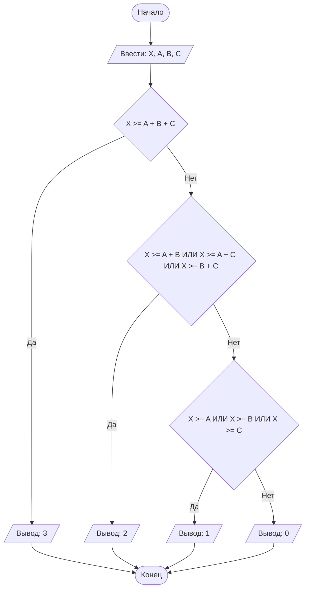

## Отчет по лабораторной работе N1
#### Подготовил Супруненко Евгений
#### Группа ПМ-2601
#### Вариант - 23
### Содержание:
### 1.Постановка задачи:
>В лифте с максимальной грузоподъемностью X кг находятся три человека с весом A, B, C кг.
>Необходимо определить, скольких человек лифт сможет поднять одновременно,
>не превышая допустимую нагрузку. На вход программы подаются натуральные числа X, A, B, C.

#### Для решения задачи требуется сначала сравнить X с А, В и С, и если оно будет меньше каждого из них, то вывести 0.
#### Если Х будет больше А или В или С, то сравним Х со всеми попарными суммами А, В и С, и если Х будет меньше каждого из них, то выведем 1.
#### Если Х будет больше хотя бы одной попарной суммы, то сравним Х с суммой всех трех переменных, и если Х будет меньше, то выведем 2, а в ином случае выведем 3.
Всего нужно рассмотреть 8 случаев:
1. X<A,X<B,X<C ==> Ответ 0
2. 3 случая когда X>=A или X>=B или X>=C

```java
import java.util.Scanner;
public class guide {
    public static void main(String[] args) {
        Scanner in = new Scanner(System.in);
        System.out.print("3 человека: ");
        int a = in.nextInt();
        int b = in.nextInt();
        int c = in.nextInt();
        System.out.print("грузоподъёмность лифта: ");
        int x = in.nextInt();
        if(x>=a || x>=b || x>=c)
            if(x>=a+b || x>=b+c || x>=a+c)
                if(x>=a+b+c)
                    System.out.print("3");
                else
                    System.out.print("2");
            else
                System.out.print("1");
        else
            System.out.print("0");
    }
}
//break
```

