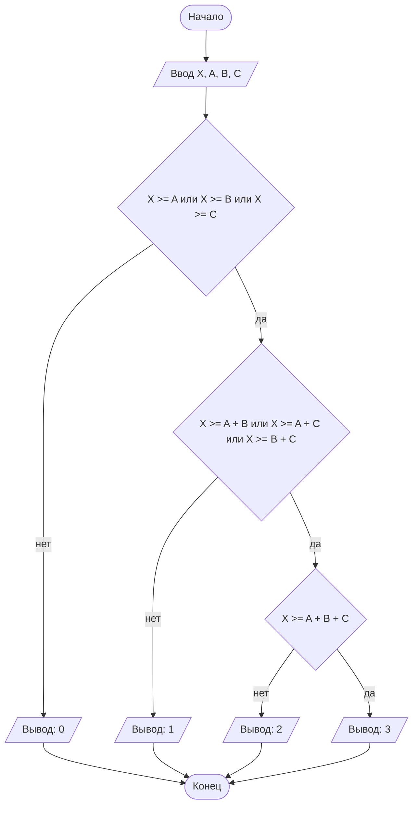

## Отчет по лабораторной работе N1
#### Подготовил Супруненко Евгений
#### Группа ПМ-2601
#### Вариант - 23
### Содержание:
### 1.Постановка задачи:
>В лифте с максимальной грузоподъемностью X кг находятся три человека с весом A, B, C кг.
>Необходимо определить, скольких человек лифт сможет поднять одновременно,
>не превышая допустимую нагрузку. На вход программы подаются натуральные числа X, A, B, C.

Данную задачу можно разбить на 3 подзадачи(проверки):
### 1. Может ли лифт поднять хотя бы одного человека?
#### Если нет, то ответ 0, иначе переходим к следующей подзадаче.
### 2. Может ли лифт поднять хотя бы одну пару людей?
#### Если нет, то ответ 1, иначе переходим к следующей подзадаче.
### 3. Может ли лифт поднять всех трех людей?
#### Если нет, то ответ 2, иначе ответ 3.
 Всего получается 8 различных случаев работы: 3 варианта с одним человеком, 3 варианта с каждой парой, 1 вариант с 3 людьми и 1 вариант без людей.

### 2. Входные и выходные данные

#### Данные на вход

#### По условию на вход подается 4 натуральных числа, следовательно их нижняя граница равна 1, а верхняя граница не указана. Как мне кажется, справедливой верхней границей будет 10<sup>9</sup>.

|               | Тип                | min значение    | max значение   |
|---------------|--------------------|-----------------|----------------|
| X (Лифт)      | Натуральное число  |       1         | 10<sup>9</sup> |
| A (Человек 1) | Натуральное число  |       1         | 10<sup>9</sup> |
| B (Человек 2) | Натуральное число  |       1         | 10<sup>9</sup> |
| C (Человек 3) | Натуральное число  |       1         | 10<sup>9</sup> |

#### Данные на выход:

На выходе программа должна выдавать одно из четырех чисел: 0, 1, 2 или 3.

|         | Тип                                | Возможные значения           |
|---------|------------------------------------|------------------------------|
| Ответ   | Целое число                        | 0, 1, 2, 3                   |

### 3. Выбор структуры данных

Программа получает 4 натуральных числа. Так как при сложении A, B и С при заданной верхней границе может получиться число, превосходящее максимальное значение из диапазона значений типа int, что может привести к неправильной работе программы. Следовательно, для хранения A, B, C и X будем использовать переменные `a`, `b`, `c`, `x`.

|               | название переменной | Тип (в Java) | 
|---------------|---------------------|--------------|
| X (Лифт)      | `x`                 | `long`       |
| A (Человек 1) | `a`                 | `long`       | 
| B (Человек 2) | `b`                 | `long`       |
| C (Человек 3) | `c`                 | `long`       | 

Для вывода результата необязательно его хранить в отдельной переменной.

### 4. Алгоритм

#### Алгоритм выполнения программы:

1. **Ввод данных:**
Программа считывает четыре натуральных числа, обозначенные как `a`, `b`, `c` и `x`.

2. **Проверка на одного человека:**
Программа сравнивает значение `x` со значениями `a`, `b` и `c`. Если `x` меньше каждого из них, то выводится 0, иначе программа идет к следующему условию:

3. **Проверка на пару человек:**
Программа сравнивает значение `x` со значениями `a` + `b`, `b` + `c` и `a` + `c`. Если `x` меньше каждого из них, то выводится 1, иначе программа идет к следующему условию:

4. **Проверка на трех человек:**
Программа сравнивает значение `x` со значением `a`+`b`+`c`. Если `x` меньше, то выводится 2, иначе выводится 3.

5. **Вывод ответа:**
На экран выводится 0, 1, 2 или 3, в зависимости от результата сравнения `x` с `a`, `b` и `c`.

### Блок-схема:



```java
import java.io.PrintStream;
import java.util.Scanner;
public class guide {
    public static PrintStream out = System.out;
    public static void main(String[] args) {
        Scanner in = new Scanner(System.in);
        System.out.print("3 человека: ");
        int a = in.nextInt();
        int b = in.nextInt();
        int c = in.nextInt();
        System.out.print("грузоподъёмность лифта: ");
        int x = in.nextInt();
        if(x>=a || x>=b || x>=c)
            if(x>=a+b || x>=b+c || x>=a+c)
                if(x>=a+b+c)
                    out.println(3);
                else
                    out.println(2);
            else
                out.println(1);
        else
            out.print(0);
    }
}
//break
```

